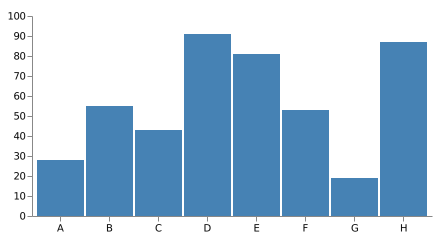

<!-- _class: lead -->

# Marp サンプルスライド

<br>

**u-hyszk**
XXX Univ.
YYYY/MM/DD

---

<!-- _header: 目次 -->

1. 見出し
2. 箇条書き
3. 脚注
4. コードブロック
5. 画像
6. Vegaで作成した画像(svg形式)
7. Draw.ioで作成した画像(svg形式)

---

<!-- _header: はじめに -->

# 見出し1

## 見出し2

### 見出し3

#### 見出し4

##### 見出し5

###### 見出し6

---

<!-- _header: 箇条書き -->

- 箇条書き1
  - 箇条書き2
    - 箇条書き3
      - 箇条書き4
        - 箇条書き5

---

<!-- _header: 脚注 -->

> 脚注
> > 二重脚注

---

<!-- _header: コードブロック -->

```python
print("Hello World!")
```

```typescript
console.log("Hello World!")
```

```go
package main

import "fmt"

func main() {
    fmt.Println("Hello World!")
}
```

---

<!-- _header: 数式 -->

- インライン$\LaTeX$

- ブロック$\LaTeX$

$$
x = \frac{-b±\sqrt{b^2-4ac}}{2a}
$$

---

<!-- _header: 画像 -->


---

<!-- _header: Vegaで作成した画像(svg形式) -->



---

<!-- _header: Draw.ioで作成した画像(svg形式) -->


